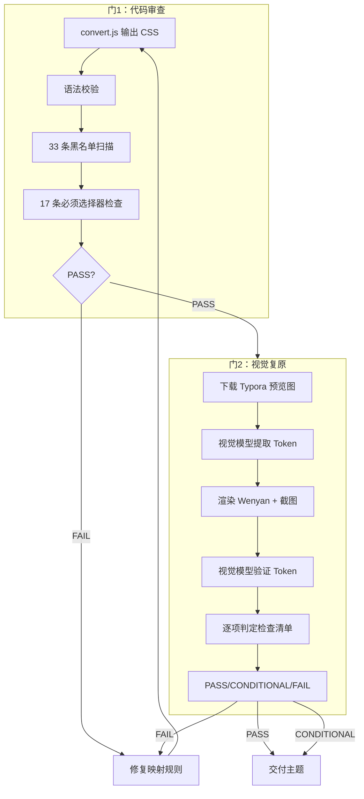

# Typora → Wenyan 主题转换 Skill

## 目的

Typora 主题社区有数百套高质量 CSS 主题。本 Skill 系统化地将 Typora CSS 转换为 Wenyan（@wenyan-md/core）兼容格式，让用户一键导入心仪主题到公众号图文消息。

## 前置条件

- Node.js >= 20（wx-newspic 环境已有）
- wx-newspic >= 0.2.0（含 `--theme-file` 能力）
- `css-tree`（已在 @wenyan-md/core 依赖树中）

## 技能目录结构

```
skills/typora-wenyan/
├── SKILL.md                       ← 本文件
├── scripts/
│   └── convert.js                 ← 转换 + 审查脚本
└── test/
    ├── markdown/
    │   └── full-test.md           ← 标准测试文章（覆盖全元素）
    └── themes/                    ← Typora 主题文件存放处
```

## 选择器映射表

### 根作用域映射

| Typora | Wenyan | 说明 |
|--------|--------|------|
| `#write` | `#wenyan` | 编辑区根容器 |
| `:root` | `:root` | CSS 变量定义（保留） |

### 内容元素映射

| Typora | Wenyan | 说明 |
|--------|--------|------|
| `h1`–`h6` | `#wenyan h1`–`h6` | 自动加作用域前缀 |
| `p` | `#wenyan p` | 段落 |
| `blockquote` | `#wenyan blockquote` | 引用块 |
| `pre` | `#wenyan pre` | 代码块 |
| `code` | `#wenyan code` / `#wenyan p code` | 代码 |
| `table` | `#wenyan table` | 表格 |
| `th`, `td` | `#wenyan th`, `#wenyan td` | 表格单元格 |
| `img` | `#wenyan img` | 图片 |
| `a` | `#wenyan a` | 链接 |
| `ul`, `ol`, `li` | `#wenyan ul/ol/li` | 列表 |
| `strong`, `em` | `#wenyan strong/em` | 加粗/斜体 |
| `hr` | `#wenyan hr` | 分隔线 |

### Typora 特有 → 标准 HTML

| Typora | Wenyan | 说明 |
|--------|--------|------|
| `.md-fences` | `#wenyan pre` | 代码围栏 |
| `.cm-s-inner` | `#wenyan pre code` | CodeMirror 代码块内部 |
| `tt` | `code` | 等宽字体（已废弃 HTML 标签） |
| `.md-image` | 删除（黑名单） | 图片包装器（img 元素保留） |

### 编辑器 UI（黑名单 — 全部删除）

```
侧栏:       .sidebar-tabs, .sidebar-tab
文件树:     .file-node-content, .file-node-title, .file-node-icon
            .file-tree-node, .file-tree
菜单:       .megamenu-menu, .megamenu-menu-header, .megamenu-menu-list
            .megamenu-content, .megamenu-opened
大纲:       .outline-item, .outline-expander, .outline-label
            .outline-content, .outline
偏好设置:   .ty-preferences
快速打开:   #typora-quick-open
专注模式:   .on-focus-mode
编辑交互:   .md-focus, .md-expand, .mac-selected
CodeMirror: .CodeMirror, .CodeMirror-gutters, .CodeMirror-linenumber
            .cm-s-inner, .sourceLine
编辑节点:   .md-toc, .md-toc-item, .md-toc-content
            .md-tag, .md-lang
            .md-mathjax-midline, .md-mathjax-preview
            .md-rawblock, .md-rawblock-control
            .md-image, .md-meta, .md-end-block-tag
            .md-diagram-panel, .md-diagram, .md-clipboard
            .md-pair-
导出:       .typora-export
```

### at-rule 处理

| at-rule | 处理 | 说明 |
|---------|------|------|
| `@import` | 删除 | 微信不支持外部资源加载 |
| `@include-when-export` | 删除 | Typora 特有导出指令 |
| `@media` | 保留 | 响应式样式保留 |
| `@font-face` | 保留 | 字体声明保留（注意微信限制） |
| `@keyframes` | 保留 | 保留（微信不支持 animation） |

## 使用方法

### 基本转换

```bash
# 转换单个 Typora 主题
node skills/typora-wenyan/scripts/convert.js path/to/typora-theme.css output.css

# 转换并输出到 stdout（用于 pipe）
node skills/typora-wenyan/scripts/convert.js path/to/theme.css > output.css
```

### 在 wx-newspic 中使用

```bash
# 1. 转换主题
node skills/typora-wenyan/scripts/convert.js ~/Downloads/drake.css drake-wenyan.css

# 2. 添加为自定义主题
wx-newspic theme add drake drake-wenyan.css

# 3. 渲染测试
wx-newspic render --md skills/typora-wenyan/test/markdown/full-test.md \
  --theme drake --theme-file ~/.wx-newspic/themes/drake.css -o preview.html
open preview.html

# 4. 发布使用
wx-newspic publish --type news --md article.md --title "标题" \
  --theme drake --theme-file ~/.wx-newspic/themes/drake.css
```

## 双质量门流程

Agent 执行完转换后，必须按以下顺序通过两扇质量门。

### 门1：代码审查（自动化）

```bash
node skills/typora-wenyan/scripts/convert.js output.css --validate
```

**审查项：**

| # | 检查项 | 方法 | 通过标准 |
|---|--------|------|---------|
| 1 | CSS 语法合法 | css-tree 再解析 | 无错误 |
| 2 | 禁止选择器泄漏 | 扫描黑名单 33 条 + 扩展字符 | = 0 |
| 3 | `#write` 残留 | 扫描所有选择器 | = 0 |
| 4 | 必须选择器缺失 | 检查 17 条核心选择器存在 | = 0 FAIL（WARN 可接受） |

**判定：**
- 所有检查 PASS → 门1 通过
- 任一 FAIL → 需调整映射规则后重新转换

### 门2：视觉复原审计（Agent 自主执行）

使用通用能力（浏览器截图 + 单图分析），不依赖专用视觉工具。

#### 阶段 A：提取设计 Token

1. 从 theme.typora.io 或 GitHub README 下载主题预览图
2. 用视觉模型分析预览图，输出 JSON 设计 Token：

```json
{
  "h1": { "color": "#xxx", "size_relation": "~1.5x body" },
  "h2": { "color": "#xxx", "decoration": "下边框/背景色/居中" },
  "body": { "color": "#xxx", "line_height": "舒适" },
  "accent_color": "#xxx",
  "blockquote": { "border_color": "#xxx", "bg": "#xxx" },
  "code_inline": { "bg": "#xxx", "radius": true },
  "code_block": { "bg": "#xxx", "border": true },
  "table": { "header_bg": "#xxx", "border": true }
}
```

#### 阶段 B：渲染 + 截图

```bash
wx-newspic render --md skills/typora-wenyan/test/markdown/full-test.md \
  --theme <name> --theme-file <path> -o /tmp/wenyan-preview.html
```

用浏览器打开并截图（推荐 viewport: 600×2000 模拟手机宽度）。

#### 阶段 C：Token 验证

用视觉模型分析 Wenyan 截图，逐项对照检查清单。

#### 检查清单

```
1. 排版层级
   □ H1 字号显著 ≥ H2
   □ H2 装饰保留（下边框/背景色/居中）
   □ H3–H6 层级视觉可区分
   □ 正文行高适中（1.6–2.0 倍字号感）

2. 颜色还原
   □ 标题色 ≈ Token
   □ 正文字色 ≈ Token
   □ 强调色（链接/加粗）≈ Token
   □ 引用块边框色 ≈ Token

3. 块级元素
   □ 引用块：左边框 + 背景可见
   □ 代码块：背景 + 边框 + 圆角可见
   □ 行内代码：背景 + 圆角，与正文分离
   □ 表格：边框 + 表头清晰
   □ 图片居中 + 响应式
   □ 分隔线样式存在

4. 视觉缺陷
   □ 无溢出截断
   □ 无重叠
   □ 无不完整样式
```

#### 判定标准

| 结果 | 条件 | 动作 |
|------|------|------|
| ✅ PASS | 全部 PASS | 主题可交付 |
| ⚠️ CONDITIONAL | PASS ≥ 10 + FAIL ≤ 2 | 交付，记录已知限制到主题说明 |
| ❌ FAIL | FAIL ≥ 3 或含视觉缺陷（4.x） | 调整映射规则，重新转换 |

### 完整质量流程



## 已知限制

- **微信 CSS 子集**：微信不支持 `position`、`animation`、`transform`、`flexbox` 部分属性。Typora 主题中使用这些属性的样式可能无法正确渲染
- **字体资源**：`@font-face` 声明的自定义字体在微信中不一定生效（取决于用户系统字体）
- **`@import` 外部资源**：已自动删除
- **响应式设计**：`@media` 保留但效果不可控（微信使用固定宽度渲染）
- **Typora 特有伪元素**：部分 Typora 主题使用复杂的 `::before`/`::after` 装饰（如标题前的 # 符号），转换后保留但可能在微信中表现不同
- **深色模式**：Typora 主题的深色模式通过 `@media (prefers-color-scheme: dark)` 实现，保留但不保证在微信中生效

## 参考资料

- [@wenyan-md/core 文档](https://github.com/lpreterite/wenyan-md)
- [Typora 主题商店](https://theme.typora.io)
- [微信公众平台前端开发规范](https://developers.weixin.qq.com/doc/offiaccount/Article_Management/Front_end_development_specification.html)
