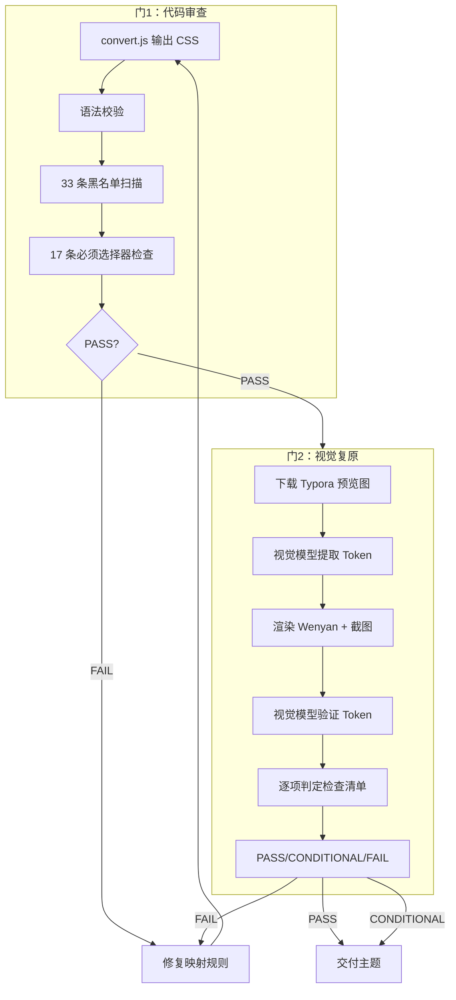

# 双质量门参考

> 步骤 3「质量门」时加载。Agent 转换完成后按此流程验证。

## 门1：代码审查（自动化）

```bash
node skills/typora2wenyan/scripts/convert.js output.css --validate
```

| # | 检查项 | 方法 | 通过标准 |
|---|--------|------|---------|
| 1 | CSS 语法合法 | css-tree 再解析 | 无错误 |
| 2 | 禁止选择器泄漏 | 扫描黑名单 33+ 条 | = 0 |
| 3 | `#write` 残留 | 扫描所有选择器 | = 0 |
| 4 | 必须选择器缺失 | 检查 17 条核心选择器 | = 0 FAIL（WARN 可接受） |

**判定：** 全部 PASS → 门1 通过；任一 FAIL → 修复映射规则后重新转换。

## 门2：视觉复原审计（Agent 自主执行）

### 阶段 A：提取设计 Token

从 theme.typora.io 或 GitHub README 下载主题预览图，用视觉模型输出 JSON Token：

```json
{
  "h1": { "color": "#xxx", "size_relation": "~1.5x body" },
  "h2": { "color": "#xxx", "decoration": "下边框/背景色/居中" },
  "body": { "color": "#xxx", "line_height": "舒适" },
  "accent_color": "#xxx",
  "blockquote": { "border_color": "#xxx", "bg": "#xxx" },
  "code_inline": { "bg": "#xxx", "radius": true },
  "code_block": { "bg": "#xxx", "border": true },
  "table": { "header_bg": "#xxx", "border": true }
}
```

### 阶段 B：渲染 + 截图

```bash
wx-newspic render --md skills/typora2wenyan/test/markdown/full-test.md \
  --theme <name> --theme-file <path> -o /tmp/wenyan-preview.html
```

浏览器打开，截图（推荐 viewport: 600×2000 模拟手机宽度）。

### 阶段 C：Token 验证

用视觉模型分析 Wenyan 截图，逐项对照：

```
1. 排版层级
   □ H1 字号显著 ≥ H2
   □ H2 装饰保留（下边框/背景色/居中）
   □ H3–H6 层级视觉可区分
   □ 正文行高适中（1.6–2.0 倍字号感）

2. 颜色还原
   □ 标题色 ≈ Token
   □ 正文字色 ≈ Token
   □ 强调色（链接/加粗）≈ Token
   □ 引用块边框色 ≈ Token

3. 块级元素
   □ 引用块：左边框 + 背景可见
   □ 代码块：背景 + 边框 + 圆角可见
   □ 行内代码：背景 + 圆角，与正文分离
   □ 表格：边框 + 表头清晰
   □ 图片居中 + 响应式
   □ 分隔线样式存在

4. 视觉缺陷
   □ 无溢出截断
   □ 无重叠
   □ 无不完整样式
```

### 判定

| 结果 | 条件 | 动作 |
|------|------|------|
| ✅ PASS | 全部 PASS | 主题可交付 |
| ⚠️ CONDITIONAL | PASS ≥ 10 + FAIL ≤ 2 | 交付，记录已知限制 |
| ❌ FAIL | FAIL ≥ 3 或含视觉缺陷（4.x） | 调整映射规则，重转换 |

## 质量流程



## 已知限制

- **微信 CSS 子集**：不支持 `position`、`animation`、`transform`、`flexbox` 部分属性
- **字体资源**：`@font-face` 自定义字体在微信中不一定生效
- **`@import` 外部资源**：已自动删除
- **响应式**：`@media` 保留但效果不可控（微信固定宽度渲染）
- **深色模式**：`@media (prefers-color-scheme: dark)` 保留不保证在微信生效
